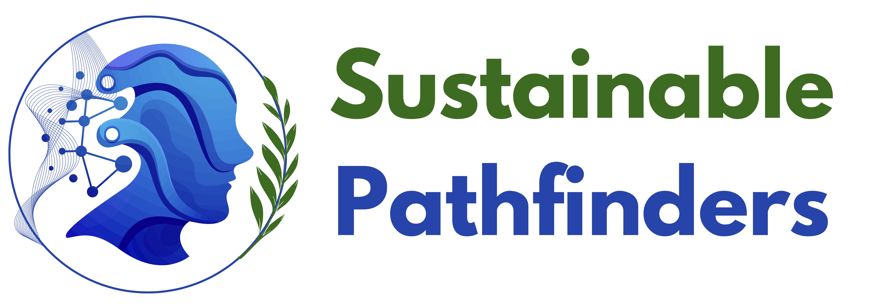

# 

# Sustainable Pathfinders – Full Stack Login & QR App

## 1. Quick Overview

This is a full-stack cross-platform application that provides:

- User **Registration and Login**
- A **Dashboard** with user information
- **QR Code generation**
- Secure **user data storage**
- **LLM-powered AI sentence generation** using OpenAI Agent SDK

---

## 2. Project Details

### Key Features

- **User Authentication:** Register/Login with email and password
- **Session Logic:** Simulated token-based authentication
- **QR Code Generator:** Unique QR code based on user ID or email
- **AI Sentence Generator:** Personalized sentence using OpenAI Agent SDK
- **Responsive UI:** Web and mobile-friendly design

### Tech Stack

- **Frontend:**
  - [Next.js](https://nextjs.org/) (React framework)
  - [Tailwind CSS](https://tailwindcss.com/)

- **Backend:**
  - [FastAPI](https://fastapi.tiangolo.com/) (Python)
  - [OpenAI Agent SDK](https://github.com/openai/openagents)

- **Database:**
  - [MongoDB](https://www.mongodb.com/)

<!-- - **DevOps:**
  - Docker & Docker Compose for containerized deployment -->

---

## 3. Architecture

### System Architecture Diagram


> The architecture includes:
> - **Next.js + Tailwind CSS** frontend
> - **FastAPI backend** with REST API endpoints
> - **MongoDB** as the data store
> - **Python-based LLM service** using OpenAI Agent SDK
> - Secure API interactions and QR generation logic

---

## 4. Installation

### Manual Setup

1. **Clone the repository:**

   ```bash
   git clone https://github.com/your-username/your-repo.git
   cd your-repo


## 🛠️ Install and Run Guide

### ✅ Install and run guide for Next.js (stp-client)


# Project Setup Instructions

To start the project, follow these steps:

1. **Start the Server**:
   - Navigate to the `stp-server` directory:
     ```bash
     cd stp-server
     ```
   - Install the necessary dependencies using either `npm` or `yarn`:
     - Using npm:
       ```bash
       npm install
       ```
     - Using yarn:
       ```bash
       yarn
       ```
   - Start the server:
     ```bash
     npm start
     ```

2. **Start the Client**:
   - Navigate to the `stp-client` directory:
     ```bash
     cd stp-client
     ```
   - Install the necessary dependencies using either `npm` or `yarn`:
     - Using npm:
       ```bash
       npm install
       ```
     - Using yarn:
       ```bash
       yarn
       ```
   - Start the client:
     ```bash
     npm start
     ```

3. **Start the Chatbot**:
   - Install the `uv` package using your package manager:
     ```bash
     install uv
     ```
   - Navigate to the `chatbot` directory:
     ```bash
     cd chatbot
     ```
   - Install the required dependencies for the chatbot:
     ```bash
     uv install
     ```
   - Run the chatbot project using `uvicorn`:
     ```bash
     uv run uvicorn main:app --reload --host 0.0.0.0 --port 8000
     ```

Make sure your environment is properly set up and that you have the required package managers (`npm`, `yarn`, `uv`) installed.


